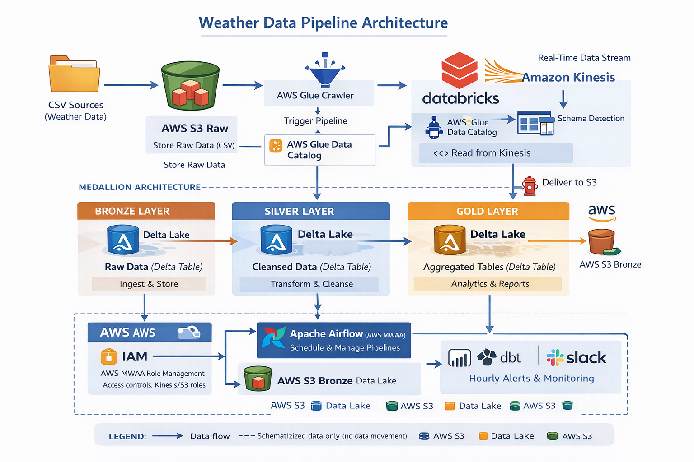

# Real-Time Weather Data Pipeline

An end-to-end, production-grade data engineering pipeline demonstrating streaming ingestion, the Medallion Architecture, Star Schema modelling, and full orchestration on AWS and Databricks.

[](https://python.org)
[](https://spark.apache.org)
[](https://databricks.com)
[](https://aws.amazon.com)
[](https://airflow.apache.org)

---

## Project Objective

Stream weather sensor data via Amazon Kinesis, process for real-time insights, and store in Delta Lake tables for forecasting and analysis. Includes error handling, data quality checks, Git integration, and Unity Catalog usage.

- **Source:** JSON payload data simulating Kaggle's "Weather Dataset for Time Series Analysis" streamed via Amazon Kinesis (includes temperature, humidity, wind speed, etc.).
- **Destinations:**
    - **Bronze:** `weather_catalog.raw.weather_readings` (raw event ingestion)
    - **Silver:** `weather_catalog.processed.valid_readings` (filtered and processed data)
    - **Gold:** `weather_catalog.analytics.weather_stats` (business-ready metrics like daily averages and extreme weather flags)
- **Transformations:** Parse JSON, filter invalid records, compute rolling metrics (e.g., hourly averages), detect extreme weather events, and tag statuses.
- **Schedule:** Continuous streaming with 10-second micro-batches.
- **Alerting & Logging:** Slack notifications triggered for extreme weather events, and structured error logs written to `weather_catalog.logs.anomaly_log`.

---

## Table of Contents

- [Project Objective](#project-objective)
- [Project Overview](#project-overview)
- [Architecture Diagram](#architecture-diagram)
- [Tech Stack](#tech-stack)
- [Repository Structure](#repository-structure)
- [Dataset](#dataset)
- [Pipeline Layers](#pipeline-layers)
- [AWS Infrastructure Setup](#aws-infrastructure-setup)
- [Airflow DAG](#airflow-dag--orchestration)
- [Slack Alerts](#slack-alerts)
- [Data Quality & Testing](#data-quality--testing)
- [Error Handling & Logging](#error-handling--logging)
- [How to Run](#how-to-run)
- [Pipeline Metrics](#pipeline-metrics)
- [Future Improvements](#future-improvements)
- [Weather Analytics Dashboard](#weather-analytics-dashboard)

---

## Project Overview

This project builds a real-time, event-driven data pipeline for the GlobalWeatherRepository dataset, analyzing 127,646 rows across 53 columns covering temperature, humidity, wind, air quality, UV index, and atmospheric data.

When a CSV file is uploaded to AWS S3, an event triggers a full streaming chain:

```
CSV Upload -> S3 Event -> Lambda -> Kinesis Data Stream -> Kinesis Firehose -> S3 Bronze (Parquet)
                                                              | (schema metadata only)
                                                         Glue Crawler -> Glue Data Catalog
                                                              |
                                              Databricks Silver (Clean & Transform)
                                                              |
                                              Databricks Gold (Dim + Fact Star Schema)
                                                              |
                                              Airflow MWAA (11-task DAG Orchestration)
                                                              |
                                                    Slack Alerts (every task)
```

Key architectural point: The Glue Crawler updates the schema metadata catalog only. It does not move the data. Databricks reads the data directly from the S3 Bronze bucket via Unity Catalog external location.

---

## Architecture Diagram



---

## Tech Stack

| Category | Technology | Purpose |
|----------|-----------|---------|
| **Storage** | AWS S3 | Data lake landing zones (raw, bronze, silver, gold, scripts, airflow) |
| **Trigger** | AWS Lambda (Python 3.12) | Event-driven ingestion firing on S3 upload |
| **Streaming** | Amazon Kinesis Data Stream | Real-time record buffer (On-Demand, 1024 KiB max record) |
| **Delivery** | Amazon Kinesis Firehose | Managed JSON to Parquet delivery mapping to S3 bronze |
| **Schema Catalog** | AWS Glue + Crawler | Metadata catalog mapping |
| **IAM** | AWS IAM | 4 roles ensuring least-privilege access |
| **Compute** | Databricks Serverless | PySpark notebooks executing Silver & Gold layers |
| **Governance** | Databricks Unity Catalog | S3 external location access managing secure identities |
| **Processing** | Apache Spark / PySpark | Distributed transformation engine for large workloads |
| **Orchestration** | Apache Airflow (AWS MWAA) | 11-task DAG managing end-to-end pipeline coordination |
| **Alerting** | Slack Webhook | Real-time task notifications via MWAA HTTP connection |
| **Language** | Python 3.12 | Core language for Lambda, DAG, and data quality scripts |
| **Testing** | PyTest | Unit tests validating data transformation logic |
| **Version Control**| Git + GitHub | Cloud source control and repository hosting |

---

## Repository Structure

The code is organized to map our logical cloud setup directly into our workspace.

```text
global-weather-pipeline/
├── Dashboard/                    # Analytics dashboards and exported pdfs/images
├── Datasets/                     # Source CSV data
│   └── GlobalWeather.csv
├── Development/
│   ├── Bronze/                   # Raw ingestion and validation logic
│   ├── DAG/                      # Airflow DAG orchestration script
│   ├── Gold/                     # Star schema dimensional modelling logic
│   ├── Silver/                   # Cleaning, type casting, imputation logic
│   └── error handling/           # Pipeline error capture and write routines
├── Testing/
│   ├── Data quality/             # Automated validation scripts for each layer
│   └── PyTest/                   # Unit test logic for PySpark assertions
└── README.md                     # This documentation file
```

---

## Dataset

- **Name:** GlobalWeatherRepository
- **Rows:** 127,646
- **Original Columns:** 53
- **Primary Key:** `weather_record_id` (surrogate integer 1–127,646)
- **Nulls:** 0 (clean source)
- **Duplicates:** 0 (verified)
- **File Format:** CSV -> Parquet (Bronze onwards)
- **Partitioned By:** Country
- **AWS Region:** ap-south-1 (Mumbai)

Column categories include weather measurements (temperature, humidity, wind, pressure), air quality measurements (PM2.5, Ozone), astronomical estimates, location data, and descriptive text labels.

---

## Pipeline Layers

### Bronze Layer (Raw Ingestion)

The golden rule for the Bronze layer is to store the data exactly as it arrived without business logic modifications. 
The Bronze ingestion reads the raw CSV via S3 inferencing without heavy casting, adds three essential audit columns (`_bronze_ingested_at`, `_bronze_source_file`, `_bronze_batch_id`), and writes a permanent Parquet trace to the S3 bucket partitioned cleanly by Country. From there, it registers with the Hive Metastore for later layers.

### Silver Layer (Cleaning & Transformation)

The goal of Silver to make data fully trustworthy so Gold can simply aggregate based on it.
- **Column Rename & Schema Enforcement:** Cleans system characters and maps column names securely.
- **Type Casting & Standardization:** Upcasts strings to timestamps, doubles, and integer types where appropriate.
- **Null Imputation:** Calculates averages on non-null rows to inject into blank locations.
- **Deduplication & Outlier Removal:** Filters physically impossible constraints (like humidity exceeding 100%, negative UV indices, or bad sensor reads).

### Gold Layer (Star Schema)

The Gold layer structures data into a clean, business-ready format to directly fuel analytic visualizations.
It builds a strict dimensional star schema focusing on `fact_weather` holding the primary metrics, mapping foreign keys to `dim_location`, `dim_condition`, `dim_astronomy`, and `dim_date`.

---

## AWS Infrastructure Setup

### Prerequisites
- AWS account with admin access
- Region: ap-south-1 (Mumbai) for all services
- S3 bucket: `global-weather-pipeline`

### Setup Summary
1. **S3 Folder Mapping:** Create standard directories routing `raw/`, `bronze/`, `silver/`, `gold/`, `scripts/`, `airflow/dags/`.
2. **IAM Profiling:** Create 4 distinct service roles mapping Lambda, Firehose, Glue Crawler, and Databricks.
3. **AWS Glue:** Create a mapped schema database mapping to the unified parquet structures inside the S3 bronze target.
4. **Kinesis Data Stream:** Set an on-demand real-time buffering limit catching Lambda payloads.
5. **Kinesis Firehose:** Setup target conversion writing the buffer chunks dynamically into Parquet targeting the AWS Glue mappings.
6. **AWS Lambda:** Setup Python 3.12 capturing the raw bucket upload triggers and looping to stream 500-record JSON payload batches safely via Kinesis API.

---

## Airflow DAG Orchestration

The Airflow DAG runs on managed AWS MWAA and orchestrates the full pipeline using 11 distinct tasks:

1. `notify_start` (Slack alert)
2. `wait_for_raw_csv` (S3 Sensor polling)
3. `notify_file_detected` (Slack alert)
4. `run_glue_crawler` (AWS trigger updating metadata catalog)
5. `notify_glue_done` (Slack alert)
6. `run_bronze` (Databricks execution call)
7. `notify_bronze_done` (Slack alert)
8. `run_silver` (Databricks execution call)
9. `notify_silver_done` (Slack alert)
10. `run_gold` (Databricks execution call)
11. `notify_pipeline_complete` (Slack alert on true success status)

---

## Slack Alerts

Slack alerts are executed on every single state change across the pipeline. This does not rely on local scripts, but is natively handled through the Airflow HTTP Connection feature mapped securely directly to a workspace specific webhook address. 

Pipeline failures explicitly throw distinct logging markers alerting the team natively.

---

## Data Quality & Testing

### Data Quality Checks

Automated row integrity checks validate conditions natively across the data frames immediately following generation.

| Check Target | Bronze Rules | Silver Rules | Gold Rules |
|-------|--------|--------|------|
| Row count | Must perfectly equal source CSV | Must align vs Bronze checks | Must align vs Silver checks |
| Content format | Audit variables natively initialized | Imputation correctly applied without nulls | All Fact foreign keys safely present matching dimensions |
| Consistency | N/A | Drop logic executed safely rejecting bad measurements | Duplicate primary keys fully negated on Dimensions |

### Unit Tests

We execute testing suites targeting the core transformations independently across the modules.

```bash
# Run tests locally from root folder mapping
pytest Testing/PyTest/ -v
```

---

## Error Handling & Logging

Logging functions explicitly catch any streaming ingestion failures or Databricks processing discrepancies.

They output mapping alerts covering:
- Lambda and Kinesis limits triggers.
- Schema matching logic breaks between Bronze and Silver runs.
- Duplicate record flags caught in transformation.
- Failed Null variables blocking standard conversion logic.

---

## How to Run

### Full Pipeline (Automated)

1. Set up the foundational AWS architecture following the structural logic guidelines.
2. Upload the base DAG to S3 inside the defined `airflow/dags/` path mappings.
3. Upload the target Dataset to `s3://global-weather-pipeline/raw/` path to natively trigger the Lambda hooks.
The workflow automatically invokes mapping through Kinesis, pushing up to Bronze, which wakes up Airflow pulling to Databricks Silver and Gold mappings.

### Manual Local Checks

Unit tests can easily be triggered inside the mapped IDE by referencing our `Testing` framework mapping.

```bash
pip install pytest pyspark
pytest Testing/PyTest/ -v
```

---

## Pipeline Metrics

- **Records Transmitted:** 127,646
- **Source Columns Captured:** 54 total parameters tracked
- **API Throughput Limit Strategy:** Batched at 500 record streams via Lambda loops
- **Architecture Role Density:** 4 absolute minimal privilege IAM configurations
- **Data Model Targets:** 4 standalone core dimensions powering 1 master analytic fact table

---

## Future Improvements

- Target explicit conversion of Gold Layer structures to standard Delta Lake formatted structures permitting better ACID and Time Travel workflows natively.
- Integrate Databricks Auto Loader natively to cleanly manage partial incremental ingests across raw folders securely over time.
- Implement explicit automated CloudWatch alarm webhooks managing deeper Lambda execution constraints without developer involvement.

---

## Weather Analytics Dashboard

Below are selected summary visual insights rendered strictly using finalized Gold Layer analytics datasets tracking explicit target values globally.

### Global Temperature Insights
.png)

### Rainfall Insights


### Air Quality Insights


### Wind Insights


### UV Risk Analysis


### Regional Air Quality Index


### Visibility Distribution

