# Real-Time Weather Data Pipeline

 **End-to-end, production-grade data engineering pipeline** — streaming ingestion, Medallion Architecture, Star Schema modelling, and full orchestration on AWS + Databricks.

[](https://python.org)
[](https://spark.apache.org)
[](https://databricks.com)
[](https://aws.amazon.com)
[](https://airflow.apache.org)
[](LICENSE)

---

## 👥 Team

| Name | Role |
|------|------|
| **Adeesh Koshal** | Team Lead — Full-Stack Pipeline Architect |
| **Tushar Rile** | AWS Infrastructure & Streaming Specialist |
| **Revanth Sai** | Databricks & Data Transformation Engineer |

---

##  Table of Contents

- [Project Overview](#-project-overview)
- [Architecture Diagram](#-architecture-diagram)
- [Tech Stack](#-tech-stack)
- [Repository Structure](#-repository-structure)
- [Dataset](#-dataset)
- [Pipeline Layers](#-pipeline-layers)
  - [Bronze Layer](#bronze-layer--raw-ingestion)
  - [Silver Layer](#silver-layer--cleaning--transformation)
  - [Gold Layer](#gold-layer--star-schema)
- [AWS Infrastructure Setup](#-aws-infrastructure-setup)
- [Airflow DAG](#-airflow-dag--orchestration)
- [Slack Alerts](#-slack-alerts)
- [Data Quality & Testing](#-data-quality--testing)
- [Error Handling & Logging](#-error-handling--logging)
- [How to Run](#-how-to-run)
- [Folder Structure Guide](#-folder-structure-guide)

---

## 🔍 Project Overview

This project builds a **real-time, event-driven data pipeline** for the GlobalWeatherRepository dataset — 127,646 rows across 53 columns covering temperature, humidity, wind, air quality, UV index, and astronomical data.

The moment a CSV file is uploaded to **AWS S3**, an event triggers a full streaming chain:

```
CSV Upload → S3 Event → Lambda → Kinesis Data Stream → Kinesis Firehose → S3 Bronze (Parquet)
                                                              ↓ (schema metadata only)
                                                         Glue Crawler → Glue Data Catalog
                                                              ↓
                                              Databricks Silver (Clean & Transform)
                                                              ↓
                                              Databricks Gold (Dim + Fact Star Schema)
                                                              ↓
                                              Airflow MWAA (11-task DAG Orchestration)
                                                              ↓
                                                    Slack Alerts (every task)
```

> **Key architectural point:** The Glue Crawler updates the **schema metadata catalog only** — it does NOT move data. Databricks reads data **directly from S3 Bronze** via Unity Catalog external location.

---

## 🏗️ Architecture Diagram

```
┌─────────────┐    ┌──────────────┐    ┌─────────────┐    ┌──────────────────┐    ┌──────────────┐
│  CSV Source  │───▶│  S3  raw/    │───▶│ AWS Lambda  │───▶│ Kinesis Data     │───▶│ Kinesis      │
│ 127,646 rows │    │ S3 Event     │    │ Python 3.12 │    │ Stream           │    │ Firehose     │
│  53 columns  │    │ Notification │    │ ~256 batches│    │ On-Demand        │    │ JSON→Parquet │
└─────────────┘    └──────────────┘    └─────────────┘    └──────────────────┘    └──────┬───────┘
                                                                                          │
                                                                                          ▼
                          ┌─────────────────────────────────────────────────────┐  ┌─────────────┐
                          │              S3  bronze/  (Parquet, partitioned      │  │ Glue Crawler│
                          │              by Country — immutable source of truth) │  │ (metadata   │
                          └──────────────────────┬──────────────────────────────┘  │  only)      │
                                                 │ reads directly                   └─────────────┘
                                                 ▼
                          ┌──────────────────────────────────────────────────────┐
                          │          Databricks Silver  (PySpark Serverless)      │
                          │  • Column rename & schema enforcement                 │
                          │  • Type casting  • Null imputation  • Deduplication   │
                          │  • Outlier removal (humidity, temperature, UV index)  │
                          └──────────────────────┬───────────────────────────────┘
                                                 │
                                                 ▼
                          ┌──────────────────────────────────────────────────────┐
                          │           Databricks Gold  (Star Schema)              │
                          │  fact_weather + dim_location + dim_condition          │
                          │  dim_astronomy + dim_date                             │
                          └──────────────────────┬───────────────────────────────┘
                                                 │
                                                 ▼
                          ┌──────────────────────────────────────────────────────┐
                          │       Apache Airflow MWAA  (11-task DAG)              │
                          │       + Slack Webhook Alerts on every task            │
                          └──────────────────────────────────────────────────────┘
```

---

## 🛠️ Tech Stack

| Category | Technology | Purpose |
|----------|-----------|---------|
| **Storage** | AWS S3 | Data lake — raw/, bronze/, silver/, gold/, scripts/, airflow/dags/ |
| **Trigger** | AWS Lambda (Python 3.12) | Event-driven ingestion — fires on S3 raw/ upload |
| **Streaming** | Amazon Kinesis Data Stream | Real-time record buffer — On-Demand, 1024 KiB max record |
| **Delivery** | Amazon Kinesis Firehose | Managed JSON → Parquet delivery to S3 bronze/ |
| **Schema Catalog** | AWS Glue + Crawler | 54-column schema table — metadata catalog only |
| **IAM** | AWS IAM (4 roles) | Least-privilege access per service |
| **Compute** | Databricks Serverless | PySpark notebooks for Silver & Gold layers |
| **Governance** | Databricks Unity Catalog | S3 external location access — no hardcoded keys |
| **Processing** | Apache Spark / PySpark | Distributed transformation engine |
| **Orchestration** | Apache Airflow (AWS MWAA) | 11-task DAG — end-to-end pipeline coordination |
| **Alerting** | Slack Webhook | Real-time task notifications via MWAA HTTP connection |
| **Language** | Python 3.12 | Lambda, DAG, data quality scripts |
| **Testing** | PyTest | Unit tests for transformation logic |
| **Version Control** | Git + GitHub | Source control |

---

## 📁 Repository Structure

```
global-weather-pipeline/
│
├── 📂 Bronze/                          # Bronze layer — raw ingestion notebook
│   └── bronze_ingestion.ipynb          # Reads CSV from S3, adds audit columns,
│                                       # writes Parquet partitioned by Country
│
├── 📂 Silver/                          # Silver layer — cleaning & transformation
│   └── silver_transformation.ipynb     # Type casting, null imputation,
│                                       # deduplication, outlier removal
│
├── 📂 Gold/                            # Gold layer — dimensional modelling
│   └── gold_star_schema.ipynb          # Builds fact_weather + 4 Dim tables
│
├── 📂 DAG/                             # Airflow orchestration
│   └── global_weather_pipeline_dag.py  # 11-task MWAA DAG with Slack alerts
│
├── 📂 Dataset/                         # Source data
│   └── GlobalWeatherRepository_        # 127,646 rows × 53 columns
│       final_with_8_descriptive_
│       columns.csv
│
├── 📂 Data_quality_checks/             # Data validation scripts
│   └── quality_checks.ipynb            # Row count, null check, outlier report
│
├── 📂 Error handling & Logging/        # Pipeline error management
│   └── error_logging.ipynb             # Error capture, log tables, alerts
│
├── 📂 PyTest/                          # Unit tests
│   └── test_transformations.py         # PyTest cases for Silver logic
│
├── 📂 dashboard/                       # Analytics dashboards
│   └── weather_dashboard.ipynb         # Databricks dashboard / BI queries
│
└── README.md                           # This file
```

> **Note on Slack:** Slack integration is configured via an **Airflow HTTP Connection** (`slack_webhook`) in AWS MWAA — it does not require a separate script file. The webhook URL is stored in the MWAA encrypted connections store and referenced directly in the DAG.

---

## Dataset

| Property | Value |
|----------|-------|
| **Name** | GlobalWeatherRepository |
| **Rows** | 127,646 |
| **Original Columns** | 53 |
| **Primary Key** | `weather_record_id` (surrogate, integer 1–127,646) |
| **Nulls** | 0 (clean source) |
| **Duplicates** | 0 (verified) |
| **File Format** | CSV → Parquet (Bronze onwards) |
| **Partitioned By** | Country |
| **AWS Region** | ap-south-1 (Mumbai) |
| **S3 Bucket** | `global-weather-pipeline` |

**Column Categories:**

- **Weather measurements** — temperature (°C/°F), humidity, wind speed/direction/degree, pressure, precipitation, visibility, UV index, cloud cover, feels-like, gust
- **Air quality** — PM2.5, PM10, CO, Ozone, NO2, SO2, US EPA index, GB DEFRA index
- **Astronomy** — sunrise, sunset, moonrise, moonset, moon phase, moon illumination
- **Location** — country, location name, latitude, longitude, timezone, region category, weather station name, sensor type
- **Descriptive labels** — temperature category, humidity level, wind intensity, precipitation level, visibility category, UV risk level, air quality category, cloud cover level

---

## Pipeline Layers

### Bronze Layer — Raw Ingestion

> **Golden Rule: Store data exactly as it arrived. Zero modifications.**

The Bronze layer notebook (`Bronze/bronze_ingestion.ipynb`) performs:

1. **Raw CSV read** from `s3://global-weather-pipeline/raw/` using `inferSchema=True` — no type casting
2. **3 audit columns added** (the only permitted modification):
   - `_bronze_ingested_at` — exact timestamp of ingestion
   - `_bronze_source_file` — S3 path of origin file
   - `_bronze_batch_id` — UUID per Lambda invocation
3. **Parquet write** to `s3://global-weather-pipeline/bronze/` partitioned by `Country`
4. **Hive Metastore registration** — queryable as `weather_bronze.raw_weather_data`
5. **Validation checkpoint** — row count (127,646), column count (57 = 53 + 1 PK + 3 audit), partition existence

**Audit columns explained:**

| Column | Purpose |
|--------|---------|
| `_bronze_ingested_at` | Answers: "was this data current at report time?" |
| `_bronze_source_file` | Answers: "which source file did this row come from?" |
| `_bronze_batch_id` | Answers: "which Lambda invocation loaded this batch?" |

---

### Silver Layer — Cleaning & Transformation

> **Goal: Make data trustworthy and consistent. Gold trusts Silver completely.**

The Silver notebook (`Silver/silver_transformation.ipynb`) applies 4 transformation steps:

**Step 01 — Column Rename & Schema Enforcement**
```python
df = df.withColumnRenamed("air_quality_PM2.5", "air_quality_pm2_5")
       .withColumnRenamed("air_quality_us-epa-index", "air_quality_us_epa_index")
       # dots and hyphens not allowed in Glue/Spark column names
```

**Step 02 — Type Casting & Standardization**
```python
df = df.withColumn("last_updated", to_timestamp("last_updated"))
       .withColumn("temperature_celsius", col("temperature_celsius").cast(DoubleType()))
       .withColumn("humidity", col("humidity").cast(IntegerType()))
       # + condition_text case standardization
```

**Step 03 — Null Imputation**
```python
# Means computed from non-null rows BEFORE imputation (avoids bias)
temp_mean = df.filter(col("temperature_celsius").isNotNull()).select(mean("temperature_celsius")).first()[0]
df = df.fillna({"temperature_celsius": float(round(temp_mean, 2)), "condition_text": "Unknown"})
```

**Step 04 — Deduplication & Outlier Removal**
```python
df = df.dropDuplicates()
       .filter(col("humidity") <= 100)        # physically impossible above 100
       .filter(col("temperature_celsius") != 999)  # sensor error code
       .filter(col("uv_index") >= 0)          # UV cannot be negative
```

**Silver Audit Checkpoint:** zero-null verification, dedup count, outlier removal count per rule, schema print, row count reconciliation against Bronze.

---

### Gold Layer — Star Schema

> **Goal: Business-ready Dim/Fact tables for analytics.**

The Gold notebook (`Gold/gold_star_schema.ipynb`) builds a **Star Schema**:

```
                        ┌─────────────────┐
                        │  dim_location   │
                        │ PK: location_id │
                        └────────┬────────┘
                                 │
┌───────────────┐    FK          │         FK    ┌─────────────────┐
│   dim_date    │◄───────────────┤───────────────►│  dim_condition  │
│ PK: date_id   │           ┌───┴───┐            │ PK: condition_id│
└───────────────┘           │ fact  │            └─────────────────┘
                            │weather│
                            │  PK:  │
                            │weather│         FK    ┌─────────────────┐
                            │record │───────────────►│  dim_astronomy  │
                            │  _id  │            │ PK: astronomy_id│
                            └───────┘            └─────────────────┘
```

| Table | Type | Key Columns |
|-------|------|-------------|
| `fact_weather` | Fact | weather_record_id (PK), all numeric measurements, 4 FK keys |
| `dim_location` | Dimension | location_id (PK), country, location_name, lat/lng, timezone, station |
| `dim_condition` | Dimension | condition_id (PK), condition_text, all category labels |
| `dim_astronomy` | Dimension | astronomy_id (PK), sunrise/sunset, moonrise/moonset, moon_phase |
| `dim_date` | Dimension | date_id (PK), date, hour, month, year, day_of_week, season, is_weekend |

**Gold Audit Checkpoint:** Fact row count = Silver row count, FK completeness check, Dim PK uniqueness, null check on all FK columns.

---

## ☁️ AWS Infrastructure Setup

### Prerequisites

- AWS account with admin access
- Region: **ap-south-1 (Mumbai)** for ALL services
- S3 bucket: `global-weather-pipeline`

### Step 1 — S3 Bucket Structure

Create these folders inside `global-weather-pipeline`:

```
s3://global-weather-pipeline/
├── raw/             ← upload CSV here to trigger pipeline
├── bronze/          ← Firehose writes Parquet here automatically
├── silver/          ← Databricks Silver notebook writes here
├── gold/            ← Databricks Gold notebook writes here
├── scripts/         ← Lambda & Glue script references
└── airflow/
    └── dags/        ← upload global_weather_pipeline_dag.py here
```

### Step 2 — IAM Roles (4 roles, least-privilege)

| Role Name | Used By | Permissions |
|-----------|---------|-------------|
| `lambda-weather-role` | AWS Lambda | AmazonS3ReadOnlyAccess, AmazonKinesisFullAccess, CloudWatchLogsFullAccess |
| `firehose-weather-role` | Kinesis Firehose | AmazonS3FullAccess, AmazonKinesisFullAccess, AWSGlueServiceRole |
| `glue-weather-role` | AWS Glue Crawler | AWSGlueServiceRole, AmazonS3FullAccess, CloudWatchLogsFullAccess |
| `databricks-weather-role` | Databricks | AmazonS3FullAccess |

### Step 3 — AWS Glue

1. Create database: `global-weather-glue-db`
2. Create table manually: `global-weather-bronze-table` with all 54 typed columns, pointing to `s3://global-weather-pipeline/bronze/`, format: Parquet
3. Create crawler: `global-weather-glue-crawler`
   - Source: `s3://global-weather-pipeline/bronze/`
   - IAM Role: `glue-weather-role`
   - Target database: `global-weather-glue-db`
   - Table prefix: `bronze_`
   - Schedule: On Demand (triggered by Airflow)

### Step 4 — Kinesis Data Stream

```
Name:          global-weather-data-stream
Capacity mode: On-Demand
Max record:    1024 KiB
Region:        ap-south-1
```

### Step 5 — Kinesis Firehose

```
Name:             global-weather-firehose
Source:           Kinesis Data Stream → global-weather-data-stream
Destination:      S3 → s3://global-weather-pipeline/bronze/
Format:           Enable record format conversion → Apache Parquet
Glue DB:          global-weather-glue-db
Glue Table:       global-weather-bronze-table
Error prefix:     bronze-errors/
IAM Role:         firehose-weather-role
```

### Step 6 — AWS Lambda

```
Function name:  global-weather-lambda
Runtime:        Python 3.12
Memory:         512 MB
Timeout:        5 minutes
IAM Role:       lambda-weather-role
Trigger:        S3 → global-weather-pipeline → raw/ prefix → .csv suffix
```

The Lambda function (`scripts/lambda_function.py`) reads the uploaded CSV and sends records to Kinesis in batches of 500 (Kinesis max per `put_records` call):

```python
for row in reader:
    batch.append({'Data': json.dumps(row).encode('utf-8'), 'PartitionKey': row.get('country', 'default')})
    if len(batch) == 500:
        kinesis.put_records(Records=batch, StreamName='global-weather-data-stream')
        batch = []
# ~256 API calls to stream all 127,646 records
```

---

## ⚙️ Airflow DAG — Orchestration

The DAG file (`DAG/global_weather_pipeline_dag.py`) runs on **AWS MWAA** and coordinates the full pipeline via 11 tasks:

```
notify_start → wait_for_raw_csv → notify_file_detected
    → run_glue_crawler → notify_glue_done
    → run_bronze → notify_bronze_done
    → run_silver → notify_silver_done
    → run_gold → notify_pipeline_complete
```

| Task | Type | Description |
|------|------|-------------|
| `notify_start` | Slack | Pipeline start alert |
| `wait_for_raw_csv` | S3 Sensor | Waits for CSV in raw/ folder |
| `notify_file_detected` | Slack | File detected alert |
| `run_glue_crawler` | AWS | Triggers Glue Crawler — updates schema catalog |
| `notify_glue_done` | Slack | Catalog updated alert |
| `run_bronze` | Databricks | Executes Bronze ingestion notebook |
| `notify_bronze_done` | Slack | Bronze complete alert |
| `run_silver` | Databricks | Executes Silver transformation notebook |
| `notify_silver_done` | Slack | Silver complete alert |
| `run_gold` | Databricks | Executes Gold Star Schema notebook |
| `notify_pipeline_complete` | Slack | Pipeline success alert |

**Airflow Connections required (Admin → Connections in MWAA UI):**

| Connection ID | Type | Details |
|--------------|------|---------|
| `aws_default` | Amazon Web Services | AWS Access Key + Secret + `{"region_name": "ap-south-1"}` |
| `databricks_default` | HTTP | Host: your Databricks workspace URL, Password: PAT token |
| `slack_webhook` | HTTP | Host: `https://hooks.slack.com`, Password: full webhook URL |

---

## Slack Alerts

Slack notifications are sent on **every task state change** in the pipeline. No separate script is needed — the integration is built into the Airflow DAG using an **HTTP Connection** (`slack_webhook`) stored in MWAA's encrypted connections store.

**Setup steps:**
1. Go to [api.slack.com/apps](https://api.slack.com/apps) → Create New App → From scratch
2. App name: `Weather Pipeline Alerts` → Select your workspace
3. Click **Incoming Webhooks** → Toggle ON → Add to Workspace → select channel (e.g. `#weather-pipeline`)
4. Copy the webhook URL: `https://hooks.slack.com/services/T.../B.../xxx`
5. In MWAA UI → Admin → Connections → Add connection:
   - Connection ID: `slack_webhook`
   - Type: HTTP
   - Host: `https://hooks.slack.com`
   - Password: your full webhook URL

Alerts fire for: pipeline start, file detected, each layer completion, and final success or failure with task name.

---

## ✅ Data Quality & Testing

### Data Quality Checks (`Data_quality_checks/`)

Automated checks run after each layer:

| Check | Bronze | Silver | Gold |
|-------|--------|--------|------|
| Row count reconciliation | ✅ Must equal source CSV | ✅ vs Bronze | ✅ vs Silver |
| Column count | ✅ 57 columns (53+1+3) | ✅ Schema verified | ✅ Per table |
| Null check | ✅ Audit cols populated | ✅ Zero nulls after imputation | ✅ No null FK keys |
| Partition check | ✅ Country folders exist | — | — |
| Duplicate check | — | ✅ dropDuplicates verified | ✅ Dim PK uniqueness |
| Outlier check | — | ✅ humidity/temp/UV rules | — |
| FK completeness | — | — | ✅ All Fact FKs exist in Dims |

### Unit Tests (`PyTest/`)

```bash
# Run from repo root
pytest PyTest/test_transformations.py -v
```

Tests cover: column rename logic, type casting correctness, null imputation values, duplicate removal, outlier filter conditions.

---

## 🚨 Error Handling & Logging

The `Error handling & Logging/` notebook captures:

- Streaming ingestion failures (Lambda timeout, Kinesis throttling)
- Schema mismatches between Bronze and Silver
- Data quality violations with row counts
- Null fields that couldn't be imputed
- Duplicate records detected pre and post dedup

Errors are written to a Delta log table and surfaced via Slack `failure` alerts in the Airflow DAG — any task failure immediately notifies the team with task name, error type, and timestamp.

---

## 🚀 How to Run

### Full Pipeline (Automated)

```bash
# 1. Ensure all AWS infrastructure is set up (see AWS Infrastructure Setup above)
# 2. Upload DAG to S3
aws s3 cp DAG/global_weather_pipeline_dag.py s3://global-weather-pipeline/airflow/dags/

# 3. Upload the dataset to S3 raw/ — this triggers the entire pipeline automatically
aws s3 cp Dataset/GlobalWeatherRepository_final_with_8_descriptive_columns.csv \
    s3://global-weather-pipeline/raw/

# Pipeline fires: Lambda → Kinesis → Firehose → S3 Bronze → Airflow DAG → Silver → Gold
```

### Manual Layer-by-Layer (Databricks)

```bash
# Run notebooks in order in your Databricks workspace:
# 1. Bronze/bronze_ingestion.ipynb
# 2. Silver/silver_transformation.ipynb
# 3. Gold/gold_star_schema.ipynb
```

### Run Tests

```bash
pip install pytest pyspark
pytest PyTest/ -v
```

---

## 📂 Folder Structure Guide

Here is the recommended folder structure for this repo and what belongs in each folder:

```
global-weather-pipeline/
│
├── Bronze/
│   ├── bronze_ingestion.ipynb      # Main Bronze notebook
│   └── bronze_validation.ipynb     # Optional: standalone validation cell
│
├── Silver/
│   ├── silver_transformation.ipynb # Main Silver notebook (all 4 steps)
│   └── silver_validation.ipynb     # Optional: standalone quality check
│
├── Gold/
│   ├── gold_star_schema.ipynb      # Main Gold notebook — Dim + Fact
│   └── gold_validation.ipynb       # Optional: FK checks, row count
│
├── DAG/
│   └── global_weather_pipeline_dag.py   # Airflow DAG — upload to S3 airflow/dags/
│
├── Dataset/
│   └── GlobalWeatherRepository_final_with_8_descriptive_columns.csv
│
├── Data_quality_checks/
│   ├── quality_checks.ipynb        # Reusable quality check functions
│   └── audit_report.ipynb          # Full audit trail across all layers
│
├── Error handling & Logging/
│   └── error_logging.ipynb         # Error capture + log table writes
│
├── PyTest/
│   ├── test_bronze.py              # Unit tests for Bronze logic
│   ├── test_silver.py              # Unit tests for Silver transformations
│   └── test_gold.py                # Unit tests for Gold Dim/Fact generation
│
├── dashboard/
│   └── weather_dashboard.ipynb     # Analytics queries + visualisations
│
└── README.md
```

> **Slack note:** No script file needed for Slack — it is configured entirely within AWS MWAA as an encrypted HTTP Connection. The DAG file already contains all Slack notification logic.

---

## 📈 Pipeline Metrics

| Metric | Value |
|--------|-------|
| Records processed | 127,646 |
| Source columns | 53 + 1 surrogate PK |
| Bronze audit columns | 3 (_ingested_at, _source_file, _batch_id) |
| Glue schema columns | 54 |
| Kinesis batch size | 500 records / API call |
| Kinesis API calls | ~256 |
| Lambda memory | 512 MB |
| Lambda timeout | 5 minutes |
| Airflow tasks | 11 |
| IAM roles | 4 (least-privilege) |
| Gold Dim tables | 4 (location, condition, astronomy, date) |
| Gold Fact table | 1 (fact_weather) |
| AWS Region | ap-south-1 (Mumbai) |

---

## 🔮 Future Improvements

- [ ] Convert Bronze/Silver/Gold writes to **Delta Lake format** for time travel, schema evolution, and ACID transactions
- [ ] Add **Delta OPTIMIZE + Z-ORDER** by country and last_updated for faster queries
- [ ] Implement **Databricks Auto Loader** for incremental Bronze ingestion
- [ ] Add **Great Expectations** for declarative data quality contracts
- [ ] Build a **Databricks SQL Dashboard** on top of Gold tables
- [ ] Add **AWS CloudWatch alarms** for Lambda errors and Kinesis throttling

---

## 📊 Weather Analytics Dashboard

Below are visual insights generated from the **Gold Layer analytics tables**.

---

### 🌡 Global Temperature Insights

.png)

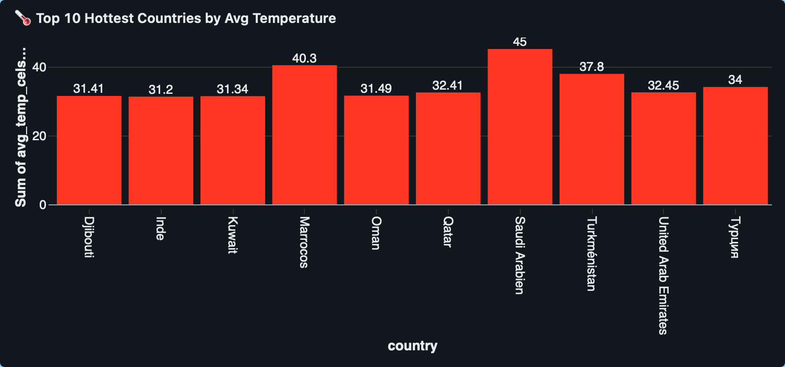

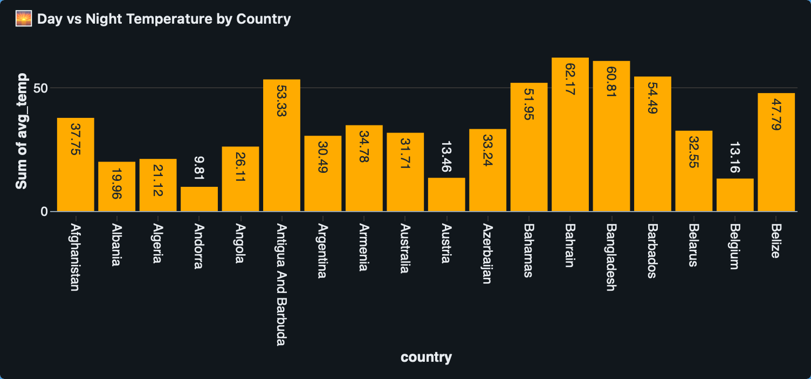

---

### 🌧 Rainfall Insights

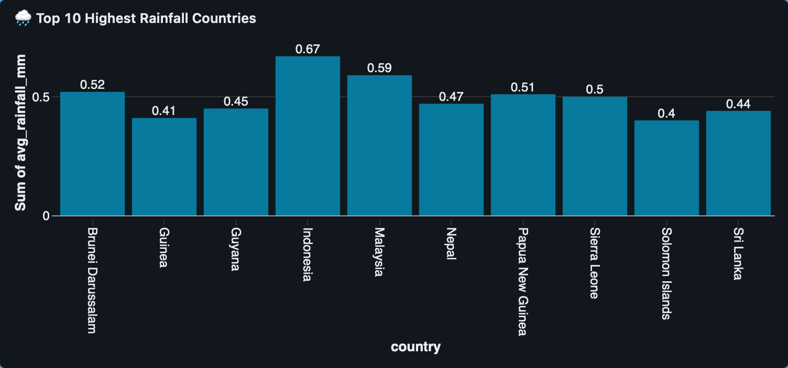

---

### 🌫 Air Quality Insights

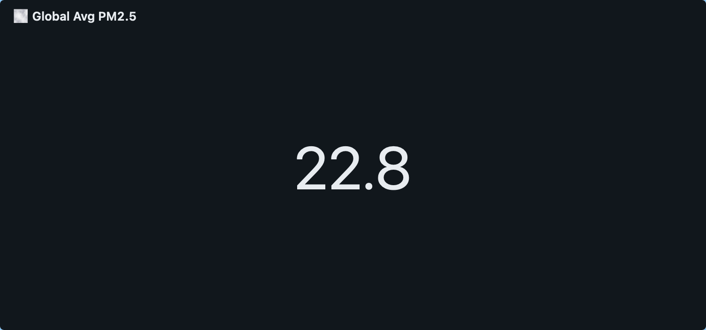

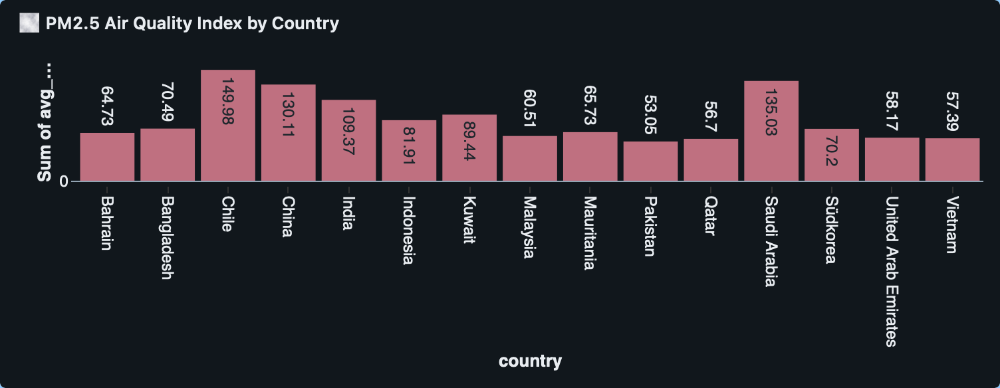

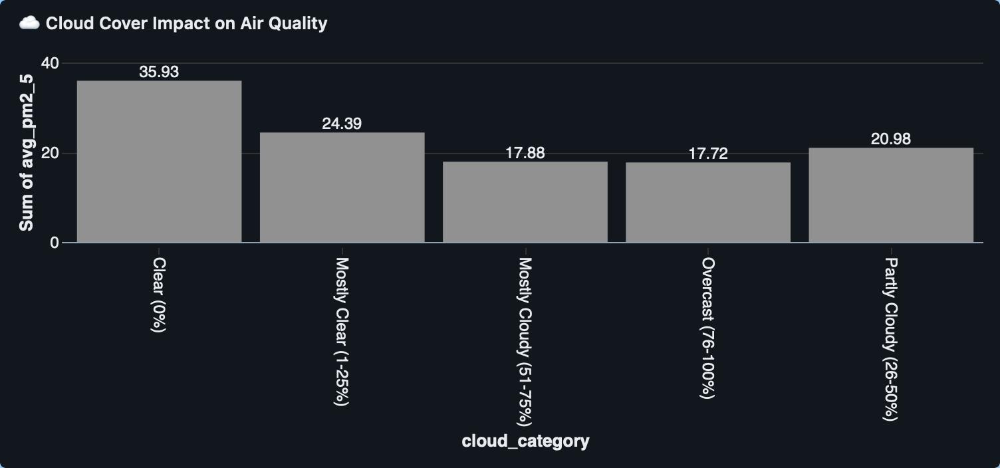

---

### ☀ Environmental Indicators

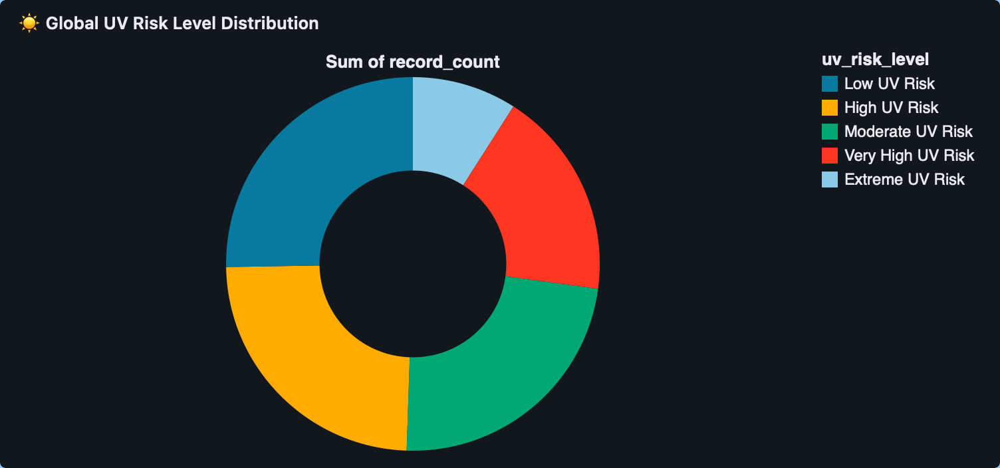

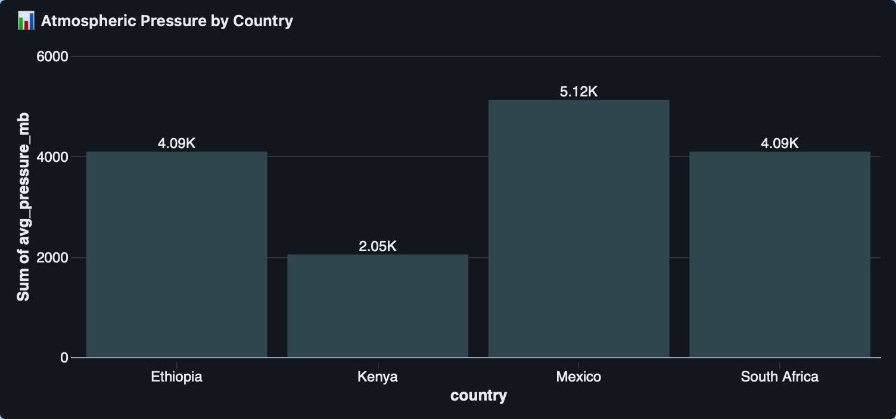

---

### 💨 Wind Insights

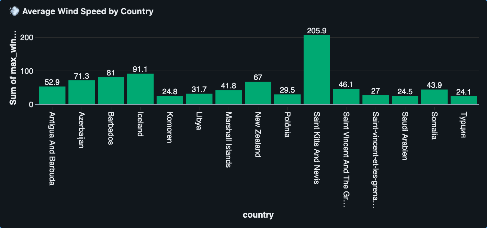

.png)

---

### 💧 Humidity Insights

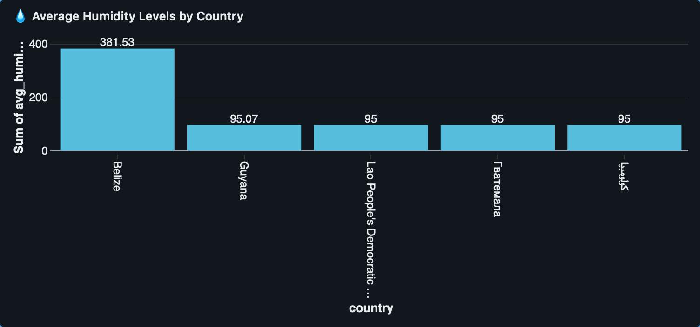

---

### 👁 Visibility Analysis

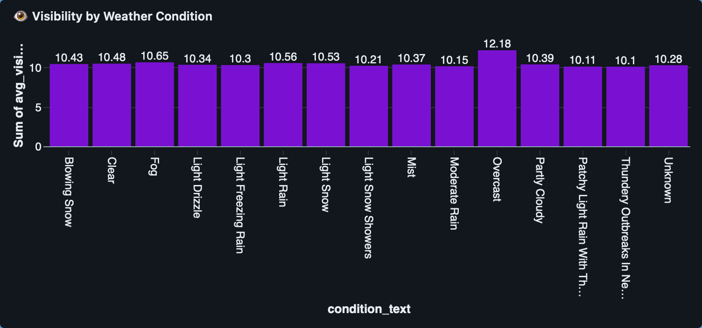

---

### ⚡ Extreme Weather Events

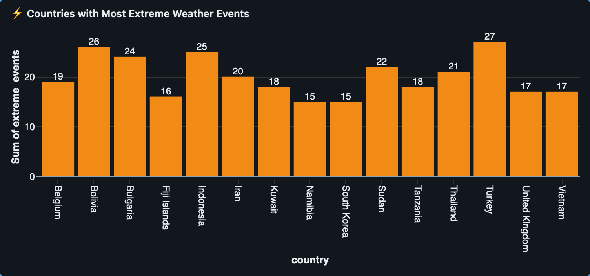

---

### 🌍 Global Coverage


